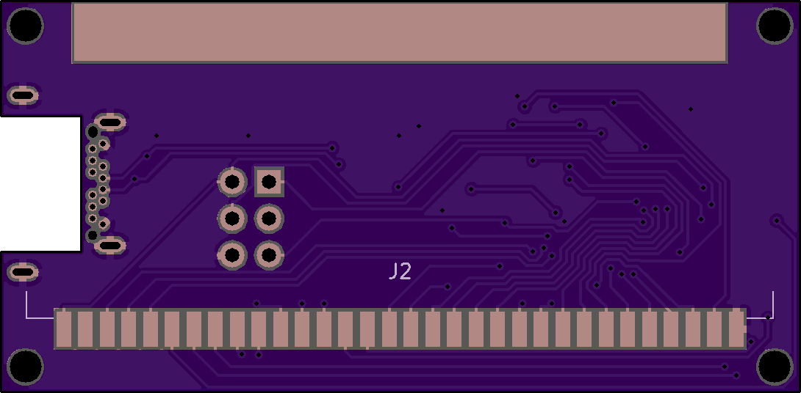
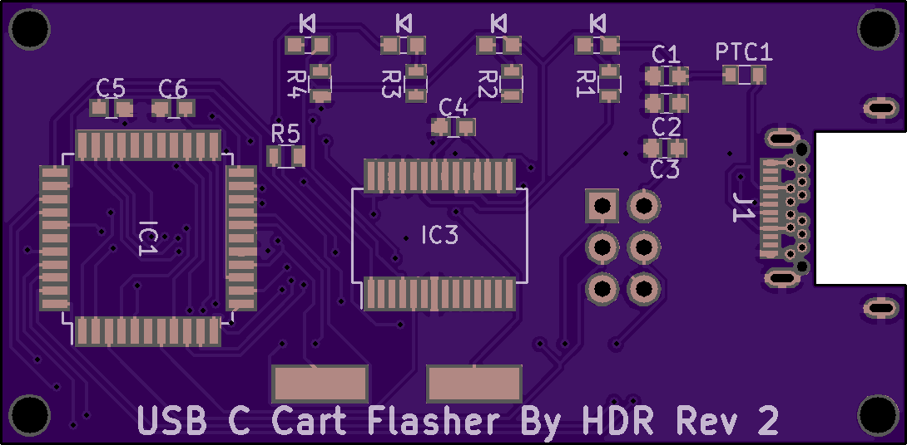

# GBFlasher-Mini
A clone of jrodrigo's flasher but with usb c

[Purchase on OSHPARK](https://oshpark.com/shared_projects/QrpUUVT3)

## Images

**BOM**

| Reference        | Part Number           | Description  |
| ------------- |:-------------:| -----:|
| C1 | 0603ZD104KAT2A | 0.1uF |
| C2 | 0603ZD104KAT2A | 0.1uF |
| C3 | NMC0603X5R106M10 | 10uF |
| C4 | 0603ZD104KAT2A | 0.1uF |
| C5 | C0603C220J5RACTU | 22pF |
| C6 | C0603C220J5RACTU | 22pF |
| IC1 | Atmega8515L-8AU ||
| IC3 | FT232RL ||
| J1 | E8124-010-01 | USB C Receptacle |
| J2 | Buy from Aliexpress | Cartridge Reader |
| LED1 | LSM0603453V | Green 0603 LED |
| LED2 | LSM0603463V | Blue 0603 LED |
| LED3 | LSM0603463V | Blue 0603 LED |
| LED4 | LSM0603412V | Red 0603 LED |
| PTC1 | MF-FSMF050X-2 | 500mA PTC Fuse |
| R1 | ERJ-PB3D1001V | 1K |
| R2 | ERJ-PB3D1001V | 1K |
| R3 | ERJ-PB3D1001V | 1K |
| R4 | ERJ-PB3D1001V | 1K |
| R5 | NTR06B1002DTRF | 10K |
| R6 | ERJ-PB3D5101V | 5.1K (Only required for usb c to usb c connections) |
| R7 | ERJ-PB3D5101V | 5.1K (Only required for usb c to usb c connections) |
| XTAL1 | ECS-60-32-5PXDN-TR | 6MHz 0603 Crystal |
